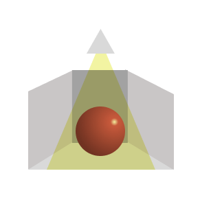
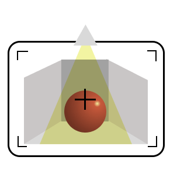

# Base para creación de entornos tridimensionales con Three.JS

## Estructura básica de three

Una escena 3D está compuesta por una **escena**, una o más **cámaras**, un **renderizador**, y diferentes elementos como **modelos**, **luces** y **materiales**.

### La escena

La escena es el elemento principal, contendrá el tamaño de la escena.
Contendrá las posiciones de la cámara, los objetos y las luces.

### Las cámaras

Será la vista que tendrá el usuario, en three.js puedes tener diferentes cámaras e ir navegando por ellas.

### El render

El motor de renderizado WebGL es una API que permite renderizar los gráficos en el navegador usando la GPU.

En three, render traduce todo a comandos WebGL y se encarga de aplicar las luces y materiales al modelo.

## HDRI - Realismo en los modelados

Las imágenes HDRI tiene un rango dinámico con mucha información de brillo y color.
Este es un truco para los modelos 3D tengan iluminaciones, colores y brillos más realistas.
-> Añadir enlace aqui
https://giancr.com/que-es-hdri-y-que-es-ldri-concepto-y-diferencias/

## Interactividad - Raycasting

En three puedes usar raycasting para detectar las interacciones del usuario con los objetos que tienes en la escena.

### ¿Cómo funciona?

Una escena 3D está compuesta por una **escena**, una o más **cámaras**, un **renderizador**, y diferentes elementos como **modelos**, **luces** y **materiales**.

# Estructura rexuli xulisima

---> threeMain.js Gestiona todos los módulos
|   /essentials    // Elementos básicos
|->   camera.js
|->   render.js
|->   scene.js
|   /utilities     // Utilidades varias básicas
|->   rayCasting.js
|->   modelLoader.js -> Gestiona el GLTF
